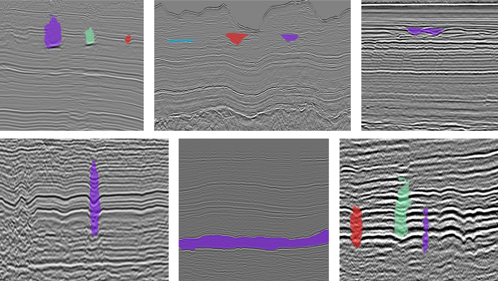
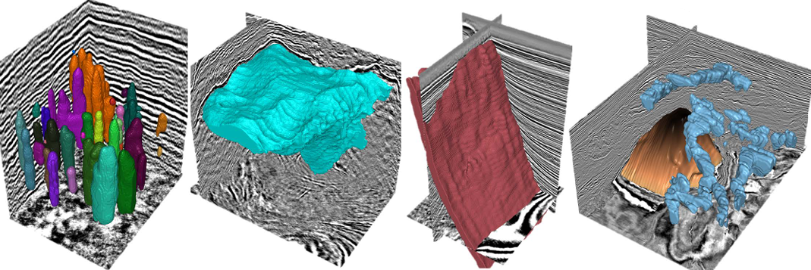

# SAG (Segment Any Geobodies)

## Introduction
We fine-tuned the SAM-Base model to obtain a SAG model that enables interactive and universal geobody segmentation on 2D seismic images across surveys. We configured SAG with a variety of prompt types, including points, bounding boxes, and logs. Interpretation experts can achieve the interpretation of various geobodies in seismic images through the interactive prompts of points, boxes and logging.

## Application
### 2D application
We interactively interpret multiple field seismic images with SAG.

We can interpret the whole seismic section with only one model.

<video id="video" controls="" preload="none" poster="video01">
<source id="mp4" src="./static/video/video01.mp4" type="video/mp4">
</video>

<video id="video" controls="" preload="none" poster="video02">
<source id="mp4" src="./static/video/video02.mp4" type="video/mp4">
</video>

### 3D application
SAG hold the potential to achieve the interpretation in 3D seismic volume by propagating prompts.

